<h1 align="left">Greetings!🤍 </h1> <small><b> Peace be upon you | Assalamualaikum | السَّلَامُ عَلَيْكُمْ </b></small>

### Computer Science Aficionado | Software Engineering Crew | Programming Instructor | Bachelors' Undergrad | Literatures and Music

🦋 I’m <b>Ettisaf Rup</b>, a Computer Science undergraduate at Khulna University of Engineering and Technology, passionate about software, hardware and system level engineering and development. I enjoy turning complex problems into practical, reliable software while exploring backend engineering, low-level systems, and computer science fundamentals. I’m driven to build robust systems and grow into a versatile software engineer.

##

 

###

  
  
  
  
  
  
  
  
  
  
  
  
  

  
  
  
  
  

###

 

## 🛠️ Tech Stack

### Languages

### Development

### Tools & Engineering

 

## ⚙️ Comforted Engineering Fields

### 🖥️ Systems Engineering

 

C / C++ · File Systems · Computer Architecture · System Utilities

 

### ☁️ Backend Engineering

 

REST APIs · Backend Services · Data & Caching

 

### 🏗️ Software Engineering

 

Software Architecture · OOP · CI/CD · Build & Release Engineering

## 📊 GitHub Stats

## 🌐 Find Me Around the Internet

 
